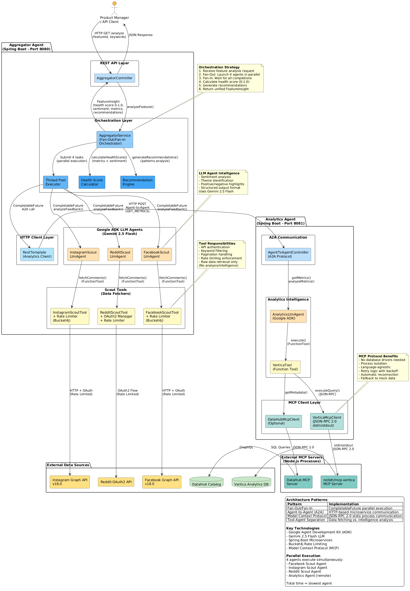

# Product Insight Engine

[](https://www.oracle.com/java/)
[](https://spring.io/projects/spring-boot)
[](https://github.com/google/genkit)
[](LICENSE)

> A multi-agent LLM system that automatically gathers, analyzes, and synthesizes product feedback from social media platforms and internal analytics using Google's Agent Development Kit and Gemini 2.5 Flash.

Transform 2-3 hours of manual product analysis into <30 seconds of automated intelligence.

---

## 📋 Table of Contents

- [Overview](#overview)
- [Architecture](#architecture)
- [Features](#features)
- [Prerequisites](#prerequisites)
- [Quick Start](#quick-start)
- [Configuration](#configuration)
- [Usage](#usage)
- [API Documentation](#api-documentation)
- [Component Diagram](#component-diagram)
- [Technology Stack](#technology-stack)
- [Project Structure](#project-structure)
- [Development](#development)
- [Testing](#testing)
- [Deployment](#deployment)
- [Troubleshooting](#troubleshooting)
- [Contributing](#contributing)
- [License](#license)

---

## 🎯 Overview

### The Problem

Product managers spend hours manually:
- Gathering comments from Facebook, Instagram, and Reddit
- Querying analytics databases for usage metrics
- Correlating feedback across disconnected data sources
- Identifying sentiment patterns and key themes

This fragmented approach makes it impossible to scale analysis across multiple features and products.

### The Solution

The Product Insight Engine uses **multi-agent orchestration** to automate comprehensive feature analysis:

- **4 Specialized LLM Agents** analyze data sources in parallel (Facebook, Instagram, Reddit, Analytics)
- **Fan-Out/Fan-In Pattern** ensures fast execution (total time = slowest agent, not sum)
- **Gemini 2.5 Flash** provides intelligent sentiment analysis and theme identification
- **Unified Health Score** (0.0-1.0) offers instant feature assessment
- **Actionable Recommendations** guide product improvements

**Result:** Comprehensive feature insights delivered in seconds, not hours.

---

## 🏗️ Architecture

The system follows a **clean separation of concerns** architecture:

```
┌─────────────────────────────────────────────────────────────┐
│                    User / API Client                        │
└─────────────────────┬───────────────────────────────────────┘
                      │ GET /analyze
                      ▼
┌─────────────────────────────────────────────────────────────┐
│              AGGREGATOR AGENT (:8080)                       │
│                                                             │
│  AggregatorService (Orchestrator)                          │
│         │                                                   │
│         ├─→ Thread Pool (Fan-Out)                          │
│         │      ├─→ Facebook Scout Agent  → Facebook API    │
│         │      ├─→ Instagram Scout Agent → Instagram API   │
│         │      ├─→ Reddit Scout Agent    → Reddit API      │
│         │      └─→ Analytics Agent (A2A) → Analytics :8081 │
│         │                                                   │
│         └─→ Fan-In: Aggregate + Calculate Health Score     │
└─────────────────────────────────────────────────────────────┘
                      │
                      ▼
┌─────────────────────────────────────────────────────────────┐
│              ANALYTICS AGENT (:8081)                        │
│                                                             │
│  AgentToAgentController (A2A Protocol)                     │
│         │                                                   │
│         └─→ AnalyticsLlmAgent                              │
│                └─→ VerticaTool                             │
│                      └─→ MCP Client (JSON-RPC)             │
│                            └─→ Vertica Database            │
└─────────────────────────────────────────────────────────────┘
```

### Key Architectural Patterns

| Pattern | Purpose |
|---------|---------|
| **Fan-Out/Fan-In** | Parallel agent execution for speed |
| **Tool-Agent Separation** | Tools fetch data, agents analyze (intelligence) |
| **Agent-to-Agent (A2A)** | Distributed microservice communication |
| **Model Context Protocol (MCP)** | Database abstraction via JSON-RPC |

---

## ✨ Features

### 🤖 Multi-Agent Intelligence
- **4 Specialized LLM Agents** powered by Gemini 2.5 Flash
- **Parallel Execution** using Java CompletableFuture
- **Autonomous Analysis** - agents create prompts and parse responses

### 📊 Comprehensive Analysis
- **Social Media Coverage**: Facebook, Instagram, Reddit
- **Internal Metrics**: Purchases, logins, session duration
- **Sentiment Analysis**: Positive/negative highlights
- **Theme Identification**: Key discussion topics
- **Health Score**: 0.0-1.0 composite metric

### 🚀 Performance
- **<30 Second Analysis** for comprehensive multi-source insights
- **Rate Limiting**: Token bucket (Bucket4j) for API quotas
- **Retry Logic**: Exponential backoff for resilience
- **Auto-reconnection**: MCP client handles database failures

### 🔧 Developer Experience
- **REST API**: Simple GET endpoint
- **Interactive CLI**: Spring Shell interface (optional)
- **Configurable**: Environment-based configuration
- **Testable**: Tools and agents independently mockable

---

## 📦 Prerequisites

### Required
- **Java 21** or higher
- **Gradle 8.x**
- **Google Cloud Account** with Vertex AI API enabled

### Optional (for full functionality)
- **Vertica Database** - for internal analytics
- **MCP Vertica Server** - `nolleh/mcp-vertica` Node.js package
- **DataHub Catalog** - for metadata enrichment
- **Social Media API Access**:
  - Facebook Graph API access token
  - Instagram Graph API access token
  - Reddit OAuth2 credentials

---

## 🚀 Quick Start

### 1. Clone the Repository
```bash
git clone <repository-url>
cd product-insight-engine
```

### 2. Set Environment Variables
```bash
# Google Cloud / Gemini
export GOOGLE_CLOUD_PROJECT="your-project-id"
export GOOGLE_API_KEY="your-api-key"

# Social Media APIs (optional)
export FACEBOOK_PAGE_ID="your-page-id"
export FACEBOOK_ACCESS_TOKEN="your-token"
export INSTAGRAM_USER_ID="your-user-id"
export INSTAGRAM_ACCESS_TOKEN="your-token"
export REDDIT_CLIENT_ID="your-client-id"
export REDDIT_CLIENT_SECRET="your-secret"
export REDDIT_USERNAME="your-username"
export REDDIT_PASSWORD="your-password"

# Database (optional)
export DB_PASSWORD="your-db-password"
```

### 3. Build the Project
```bash
./gradlew build
```

### 4. Start Analytics Agent
```bash
cd analytics-agent
./gradlew bootRun
```

*Analytics agent will start on port 8081*

### 5. Start Aggregator Agent
```bash
cd aggregator-agent
./gradlew bootRun
```

*Aggregator agent will start on port 8080*

### 6. Test the API
```bash
curl "http://localhost:8080/analyze?featureId=shopping-cart&keyword=checkout"
```

---

## ⚙️ Configuration

### Application Properties

**Aggregator Agent** (`aggregator-agent/src/main/resources/application.yml`):
```yaml
server:
  port: 8080

google:
  ai:
    project-id: ${GOOGLE_CLOUD_PROJECT}
    location: us-central1
    api-key: ${GOOGLE_API_KEY}

facebook:
  page-id: ${FACEBOOK_PAGE_ID}
  access-token: ${FACEBOOK_ACCESS_TOKEN}
  max-comments: ${FACEBOOK_MAX_COMMENTS:1000}

instagram:
  user-id: ${INSTAGRAM_USER_ID}
  access-token: ${INSTAGRAM_ACCESS_TOKEN}
  max-comments: ${INSTAGRAM_MAX_COMMENTS:1000}

reddit:
  client-id: ${REDDIT_CLIENT_ID}
  client-secret: ${REDDIT_CLIENT_SECRET}
  thread-url: ${REDDIT_THREAD_URL:}
  max-comments: ${REDDIT_MAX_COMMENTS:1000}

# Rate limiting
rate-limit:
  facebook:
    requests-per-minute: 200
  instagram:
    requests-per-minute: 200
  reddit:
    requests-per-minute: 60

# Thread pool for parallel agents
agent-executor:
  core-pool-size: 3
  max-pool-size: 10
  queue-capacity: 50
```

**Analytics Agent** (`analytics-agent/src/main/resources/application.yml`):
```yaml
server:
  port: 8081

mcp:
  servers:
    vertica:
      command: npx
      args:
        - "-y"
        - "@nolleh/mcp-vertica"
      env:
        VERTICA_HOST: ${VERTICA_HOST:localhost}
        VERTICA_PORT: ${VERTICA_PORT:5433}
        VERTICA_DATABASE: ${VERTICA_DATABASE:analytics_db}
        VERTICA_USER: ${VERTICA_USER:dbadmin}
        VERTICA_PASSWORD: ${VERTICA_PASSWORD}
```

---

## 💻 Usage

### REST API

#### Analyze Feature
```http
GET /analyze?featureId={id}&keyword={keyword}
```

**Parameters:**
- `featureId` (required) - Feature identifier (max 100 chars)
- `keyword` (required) - Search keyword for social media (max 200 chars)

**Example:**
```bash
curl "http://localhost:8080/analyze?featureId=cart-v2&keyword=checkout"
```

**Response:**
```json
{
  "featureId": "cart-v2",
  "overallHealthScore": 0.82,
  "socialSummary": "=== Social Media Analysis ===\n\nFACEBOOK:\n...",
  "metricsSummary": "Purchases: 1200, Logins: 5000, Avg Session Duration: 8.50 min",
  "recommendations": [
    "=== Recommendations ===\n\nOVERALL: Feature is performing excellently..."
  ]
}
```

### Interactive CLI (Optional)

Start in CLI-only mode:
```bash
cd aggregator-agent
./gradlew bootRun --args='--spring.profiles.active=cli'
```

Available commands:
```
agent-cli> analyze --feature-id "cart-v2" --feature-name "Shopping Cart" --keywords "checkout,payment"
agent-cli> facebook --feature-name "Shopping Cart" --keywords "checkout"
agent-cli> instagram --feature-name "Shopping Cart" --keywords "checkout"
agent-cli> reddit --feature-name "Shopping Cart" --thread-url "https://reddit.com/r/..." --keywords "checkout"
agent-cli> metrics --feature-id "cart-v2"
agent-cli> agent-help
```

---

## 📚 API Documentation

### Health Score Calculation

The health score (0.0-1.0) combines:

**Metrics Scoring (0-0.8):**
- Purchase count: weight 0.3 (normalized by 1000)
- Login count: weight 0.3 (normalized by 5000)
- Session duration: weight 0.2 (normalized by 30 minutes)

**Sentiment Scoring (0-0.2):**
- Keyword analysis across all social platforms
- Positive indicators: "love", "appreciate", "excellent", "great"
- Negative indicators: "concern", "issue", "problem", "bug"

**Thresholds:**
- **Excellent**: ≥ 0.8
- **Good**: ≥ 0.6
- **Moderate**: ≥ 0.4
- **Needs Attention**: < 0.4

### Agent-to-Agent (A2A) Protocol

Internal communication between services:

```http
POST /agent-to-agent
Content-Type: application/json

{
  "action": "GET_METRICS",
  "featureId": "cart-v2"
}
```

**Response:**
```json
{
  "metrics": {
    "featureId": "cart-v2",
    "activeUsers": 5000,
    "purchaseCount": 1200,
    "loginCount": 5000,
    "averageSessionDuration": 8.5
  }
}
```

---

## 🎨 Component Diagram



*Rendered from [component-diagram.puml](component-diagram.puml) using PlantUML*

### Generate Diagram

To generate the diagram image:

1. **Install PlantUML:**
   ```bash
   # macOS
   brew install plantuml

   # Ubuntu/Debian
   apt-get install plantuml
   ```

2. **Generate PNG:**
   ```bash
   plantuml component-diagram.puml
   ```

Or use online tools:
- [PlantUML Online Editor](http://www.plantuml.com/plantuml/uml/)
- [PlantText](https://www.planttext.com/)

---

## 🛠️ Technology Stack

### Core Framework
- **Spring Boot 3.x** - Microservice framework
- **Java 21** - Programming language with modern features
- **Gradle 8.x** - Build automation

### LLM Integration
- **Google Agent Development Kit (ADK)** - Agent orchestration framework
- **Gemini 2.5 Flash** - Large language model for analysis
- **InMemoryRunner** - Agent session management

### HTTP & Communication
- **Spring WebFlux** - Reactive web framework
- **RestTemplate** - Synchronous HTTP client
- **WebClient** - Async HTTP client for Scout tools

### Database & Data Access
- **Model Context Protocol (MCP)** - Database abstraction
- **JSON-RPC 2.0** - Protocol for MCP communication
- **Vertica** - Analytics database (optional)
- **DataHub** - Data catalog (optional)

### Resilience & Performance
- **Bucket4j** - Token bucket rate limiting
- **CompletableFuture** - Parallel async execution
- **ThreadPoolTaskExecutor** - Custom thread pool configuration

### Social Media APIs
- **Facebook Graph API v18.0**
- **Instagram Graph API v18.0**
- **Reddit OAuth2 API**

### Testing
- **JUnit 5** - Unit testing framework
- **Mockito** - Mocking framework
- **Spring Boot Test** - Integration testing

---

## 📁 Project Structure

```
product-insight-engine/
├── aggregator-agent/               # Main orchestration service
│   ├── src/main/java/com/google/ai/insight/aggregator/
│   │   ├── agents/                 # LLM agents (Facebook, Instagram, Reddit)
│   │   ├── config/                 # Spring configuration
│   │   ├── controller/             # REST controllers
│   │   ├── service/                # Orchestration service
│   │   └── tools/                  # Scout tools (data fetchers)
│   ├── src/main/resources/
│   │   └── application.yml         # Configuration
│   └── build.gradle
│
├── analytics-agent/                # Analytics intelligence service
│   ├── src/main/java/com/google/ai/insight/analytics/
│   │   ├── agents/                 # Analytics LLM agent
│   │   ├── controller/             # A2A controller
│   │   ├── mcp/                    # MCP clients
│   │   └── tools/                  # Vertica & DataHub tools
│   ├── src/main/resources/
│   │   └── application.yml         # Configuration
│   └── build.gradle
│
├── shared/                         # Shared models and utilities
│   ├── src/main/java/com/google/ai/insight/
│   │   ├── model/                  # Domain models
│   │   └── exception/              # Exception handling
│   └── build.gradle
│
├── component-diagram.puml          # Architecture diagram (PlantUML)
├── ARCHITECTURE_SKETCH.md          # Text-based architecture
├── review_1500.md                  # Project review document
├── CODE_REVIEW_FIXES.md            # Code improvements log
├── settings.gradle                 # Gradle multi-project config
└── README.md                       # This file
```

---

## 👨‍💻 Development

### Build the Project
```bash
./gradlew build
```

### Run Tests
```bash
# All tests
./gradlew test

# Skip MCP tests (requires external setup)
SKIP_MCP_TESTS=true ./gradlew test

# Specific module
./gradlew :aggregator-agent:test
./gradlew :analytics-agent:test
```

### Run Locally
```bash
# Terminal 1 - Analytics Agent
cd analytics-agent
./gradlew bootRun

# Terminal 2 - Aggregator Agent
cd aggregator-agent
./gradlew bootRun
```

### Hot Reload (Development)
```bash
./gradlew bootRun --continuous
```

### Code Quality
```bash
# Check for issues
./gradlew check

# View reports
open build/reports/tests/test/index.html
```

---

## 🧪 Testing

### Unit Tests
```bash
# Run all unit tests
./gradlew test

# With coverage
./gradlew test jacocoTestReport
```

### Integration Tests
```bash
# Aggregator integration tests
./gradlew :aggregator-agent:integrationTest

# Analytics integration tests
./gradlew :analytics-agent:integrationTest
```

### Manual API Testing

**1. Test Health Endpoint:**
```bash
curl http://localhost:8080/actuator/health
```

**2. Test Feature Analysis:**
```bash
curl -X GET "http://localhost:8080/analyze?featureId=test-feature&keyword=test" \
  -H "Accept: application/json"
```

**3. Test A2A Communication:**
```bash
curl -X POST http://localhost:8081/agent-to-agent \
  -H "Content-Type: application/json" \
  -d '{
    "action": "GET_METRICS",
    "featureId": "test-feature"
  }'
```

---

## 🚢 Deployment

### Docker (Recommended)

**Build Images:**
```bash
# Aggregator Agent
cd aggregator-agent
./gradlew bootBuildImage --imageName=aggregator-agent:latest

# Analytics Agent
cd analytics-agent
./gradlew bootBuildImage --imageName=analytics-agent:latest
```

**Run with Docker Compose:**
```yaml
version: '3.8'

services:
  analytics-agent:
    image: analytics-agent:latest
    ports:
      - "8081:8081"
    environment:
      - GOOGLE_CLOUD_PROJECT=${GOOGLE_CLOUD_PROJECT}
      - GOOGLE_API_KEY=${GOOGLE_API_KEY}
      - DB_PASSWORD=${DB_PASSWORD}

  aggregator-agent:
    image: aggregator-agent:latest
    ports:
      - "8080:8080"
    environment:
      - GOOGLE_CLOUD_PROJECT=${GOOGLE_CLOUD_PROJECT}
      - GOOGLE_API_KEY=${GOOGLE_API_KEY}
      - FACEBOOK_PAGE_ID=${FACEBOOK_PAGE_ID}
      - FACEBOOK_ACCESS_TOKEN=${FACEBOOK_ACCESS_TOKEN}
    depends_on:
      - analytics-agent
```

### Kubernetes

**Deploy to K8s:**
```bash
kubectl apply -f k8s/analytics-agent-deployment.yaml
kubectl apply -f k8s/aggregator-agent-deployment.yaml
kubectl apply -f k8s/ingress.yaml
```

**Auto-scaling:**
```yaml
apiVersion: autoscaling/v2
kind: HorizontalPodAutoscaler
metadata:
  name: aggregator-agent-hpa
spec:
  scaleTargetRef:
    apiVersion: apps/v1
    kind: Deployment
    name: aggregator-agent
  minReplicas: 2
  maxReplicas: 10
  metrics:
  - type: Resource
    resource:
      name: cpu
      target:
        type: Utilization
        averageUtilization: 70
```

### Cloud Run (GCP)

```bash
# Deploy Analytics Agent
gcloud run deploy analytics-agent \
  --source ./analytics-agent \
  --region us-central1 \
  --allow-unauthenticated

# Deploy Aggregator Agent
gcloud run deploy aggregator-agent \
  --source ./aggregator-agent \
  --region us-central1 \
  --allow-unauthenticated \
  --set-env-vars ANALYTICS_AGENT_URL=<analytics-agent-url>
```

---

## 🔧 Troubleshooting

### Common Issues

#### 1. "Google API Key not set"
```bash
# Set the environment variable
export GOOGLE_API_KEY="your-api-key"

# Or add to application.yml
google:
  ai:
    api-key: your-api-key
```

#### 2. "MCP Server failed to start"
```bash
# Install MCP Vertica server globally
npm install -g @nolleh/mcp-vertica

# Verify Node.js is installed
node --version  # Should be v18+
```

#### 3. "Rate limit exceeded"
Adjust rate limits in `application.yml`:
```yaml
rate-limit:
  facebook:
    requests-per-minute: 100  # Lower value
```

#### 4. "Analytics Agent connection refused"
Ensure Analytics Agent is running:
```bash
curl http://localhost:8081/actuator/health
```

Update the URL in Aggregator Agent:
```yaml
agent:
  analytics-agent-url: http://localhost:8081/agent-to-agent
```

#### 5. "SQL injection validation failed"
Feature IDs must contain only alphanumeric characters, dots, hyphens, and underscores:
```
Valid:   "feature-123", "cart_v2", "checkout.flow"
Invalid: "feature'; DROP TABLE", "test<script>"
```

### Debug Logging

Enable debug logging in `application.yml`:
```yaml
logging:
  level:
    com.google.ai.insight: DEBUG
    org.springframework.web: DEBUG
```

### Health Checks

```bash
# Aggregator Agent
curl http://localhost:8080/actuator/health

# Analytics Agent
curl http://localhost:8081/actuator/health
```

---

## 🤝 Contributing

Contributions are welcome! Please follow these guidelines:

### Code Standards
- Follow [Google Java Style Guide](https://google.github.io/styleguide/javaguide.html)
- Write unit tests for new features
- Update documentation for API changes
- Use meaningful commit messages

### Pull Request Process
1. Fork the repository
2. Create a feature branch (`git checkout -b feature/amazing-feature`)
3. Commit your changes (`git commit -m 'Add amazing feature'`)
4. Push to the branch (`git push origin feature/amazing-feature`)
5. Open a Pull Request

### Coding Guidelines
```java
// ✅ Good: Constructor injection
@RequiredArgsConstructor
public class MyService {
    private final DependencyA dependencyA;
    private final DependencyB dependencyB;
}

// ❌ Bad: Field injection
public class MyService {
    @Autowired
    private DependencyA dependencyA;
}
```

---

## 📄 License

This project is licensed under the MIT License - see the [LICENSE](LICENSE) file for details.

---

## 🙏 Acknowledgments

- **Google Agent Development Kit (ADK)** - Agent orchestration framework
- **Google Gemini** - LLM intelligence
- **Spring Boot Team** - Excellent microservice framework
- **Bucket4j** - Rate limiting library
- **Model Context Protocol** - Database abstraction standard

---

## 📞 Support

- **Documentation**: See [ARCHITECTURE_SKETCH.md](ARCHITECTURE_SKETCH.md)
- **Issues**: [GitHub Issues](https://github.com/your-org/product-insight-engine/issues)
- **Discussions**: [GitHub Discussions](https://github.com/your-org/product-insight-engine/discussions)

---

## 📊 Project Status

**Current Version**: 1.0.0

**Build Status**: 

**Code Coverage**: 

---

## 🗺️ Roadmap

See [If I had more time, this is what I'd do](review_1500.md#if-i-had-more-time-this-is-what-id-do) section for future enhancements:

- [ ] Additional social platform agents (Twitter/X, LinkedIn, TikTok)
- [ ] Trend detection agent with automatic triggers
- [ ] Comparative analysis across time periods
- [ ] Real-time streaming with WebSocket support
- [ ] Historical dashboard with visualizations
- [ ] A/B test integration
- [ ] Automated alerting (Slack/Email)
- [ ] Multi-language support
- [ ] Redis caching layer

---

**Made with ❤️ using Google Agent Development Kit and Gemini 2.5 Flash**